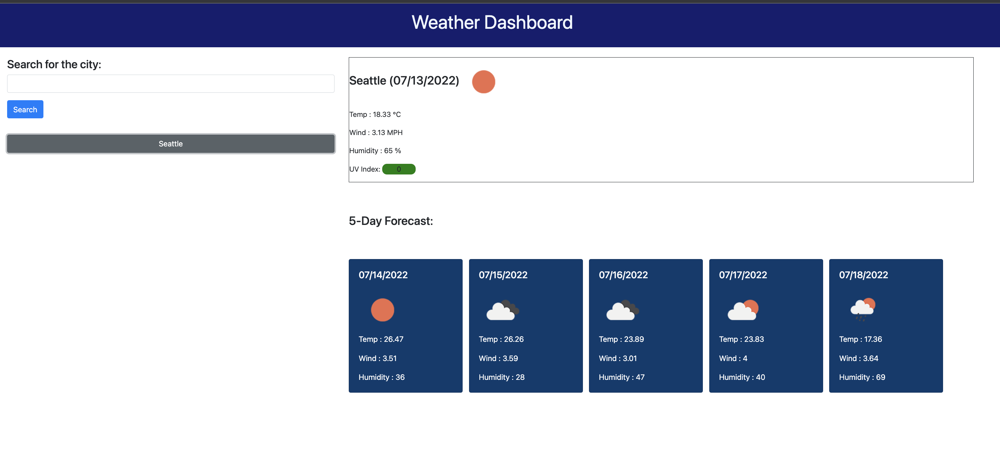
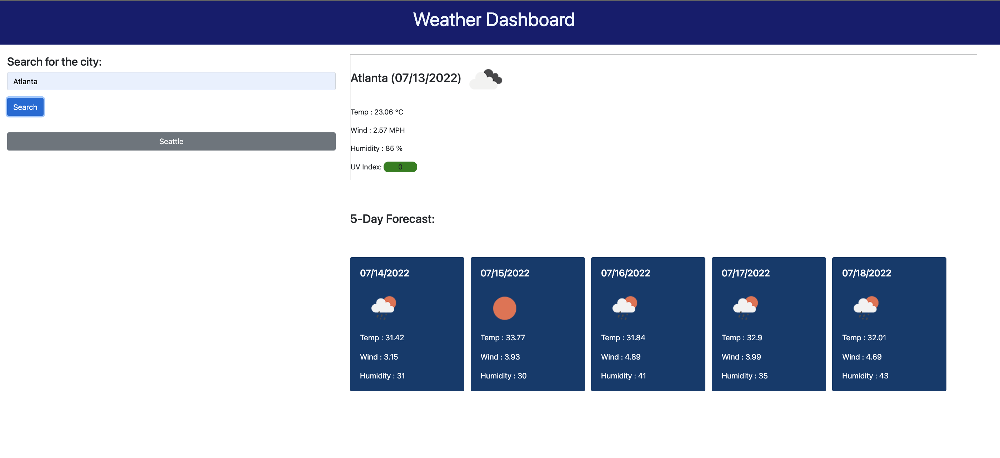

## About the repository

This repository contains code for a weather dashboard as part of University of Washington's Coding [bootcamp](https://bootcamp.uw.edu/coding/). There are two types of challenges in this course:

* On-the-job ticket or feature request challenges give a starter code in a folder called Develop, which we'll modify to complete the challenge.

* Job-seeking coding assessments or take-home assignments don't provide starter code. We'll build these from scratch.

## User story

```
AS A traveler
I WANT to see the weather outlook for multiple cities
SO THAT I can plan a trip accordingly
```

## Acceptance criteria

```
GIVEN a weather dashboard with form inputs
WHEN I search for a city
THEN I am presented with current and future conditions for that city and that city is added to the search history
WHEN I view current weather conditions for that city
THEN I am presented with the city name, the date, an icon representation of weather conditions, the temperature, the humidity, the wind speed, and the UV index
WHEN I view the UV index
THEN I am presented with a color that indicates whether the conditions are favorable, moderate, or severe
WHEN I view future weather conditions for that city
THEN I am presented with a 5-day forecast that displays the date, an icon representation of weather conditions, the temperature, the wind speed, and the humidity
WHEN I click on a city in the search history
THEN I am again presented with current and future conditions for that city
```

## Changes added

* Used OpenWeather APIs - GetCurrentWeather and Onecall APIs.

* Used Grid layout from bootstrap.

* Used jquery for action listeners.

* Used localStorage to store the cities searched.

## Result

Deployed URL: https://divyapriyababu.github.io/Weather_Dashboard



